# Lunix's Leveling Guide for TERA EU Classic

> [!CAUTION]
> This guide is currently unfinished, and certain sections may be incomplete or not fully written yet.

This guide focuses on maximizing experience gain. 

Most of this progression relies on BAM farming and a lot of those BAMs will be Kumas types.

## Table of Contents

* [Why BAMs?](#why-bams)
* [Weapon Crystals](#weapon-crystals)
  * [General BAM Weapon Setup](#general-bam-weapon-setup-all-classes)
  * [Flat BAM Setup](#flat-bam-setup)
  * [Normal Monster Farming Crystals](#normal-monster-farming-crystals)
* [Armor Crystals](#armor-crystals)
  * [BAM Armor Setup](#bam-armor-setup)
  * [Normal Monster Setup](#normal-monster-setup)
* [Charms](#charms)
  * [Recommended Charms](#recommended-charms)
  * [Notes and Budget Tips](#notes-and-budget-tips)
* [Level 1 to 13](#level-1-to-13)
* [Level 13 to 20](#level-13-to-20)
* [Level 20 to 26](#level-20-to-26)
* [Level 26 to 28](#level-26-to-28)
* [Level 28 to 33](#level-28-to-33)
* [Level 33 to 38](#level-33-to-38)

## Why BAMs?

**Pros:**

* **Fast experience:** BAMs die pretty fast for the amount of EXP they give. They don’t live much longer than trash mobs in dungeons but reward way more EXP.
* **Stationary targets:** Many of the BAMs in this guide are Kumas types, they literally sit there doing nothing while you delete them if you’re fast enough.
* **Best crystal drops:** BAMs drop a ton of crystals which are crucial for killing stuff as fast as possible.

**Downsides:**

* **Mediocre gear drops:** BAMs don’t drop the best gear. This doesn’t really matter since you’ll be using avatar weapons anyway. You’ll still get the occasional decent blue or green armor piece, which isn’t ideal but absolutely does the job. Like I said earlier, most Kumas barely move, so they won’t hurt you much regardless.

## Weapon Crystals

This part matters a lot. To make this strat actually work, you need the right crystals.

**General rules:**

* Use the highest rank you have access to for each crystal type.
* There are green and white versions of every crystal. A green crystal is usually about as good as a higher-rank white one.
* Always run back crit for BAMs and flat damage for large packs of normal mobs.
* Even if you’re playing a healer, you still probably want back crit for BAM farming.
* Crystals drop like candy from BAMs so don't waste money on them.

## General BAM Weapon Setup (all classes)

This is the setup you should be running.

| Slot | Crystal Type         | Notes                                                      |
| ---- | -------------------- | ---------------------------------------------------------- |
| 1    | Savage               | Increase crit power when attacking from behind             |
| 2    | Bitter / Acrimonious | Increase crit power against monsters or bosses from behind |
| 3    | Focused              | Increase crit power against enraged monsters               |
| 4    | Pounding / Mutinous  | Increase damage against monsters or bosses                 |

**Tips:**

* In the endgame, many classes prefer Carving over Pounding for crit chance, but avatar weapons already have insanely high crit chance, so Pounding’s flat damage ends up being better overall.
* Bitter and Pounding work on everything, but Mutinous and Acrimonious are totally fine too.

## Flat BAM Setup

I don’t recommend this for most classes, but it works pretty well on Lancers as an alternative.

| Slot | Crystal Type        | Notes                                        |
| ---- | ------------------- | -------------------------------------------- |
| 1    | Focused             | Increase crit power against enraged monsters |
| 2    | Pounding / Mutinous | Increase damage against monsters or bosses   |
| 3    | Pounding / Mutinous | Increase damage against monsters or bosses   |
| 4    | Pounding / Mutinous | Increase damage against monsters or bosses   |

## Normal Monster Farming Crystals

Use this setup when you’re clearing big packs of normal mobs.

| Slot | Crystal Type        | Notes                                              |
| ---- | ------------------- | -------------------------------------------------- |
| 1    | Pounding / Mutinous | Increase damage against monsters or bosses         |
| 2    | Pounding / Mutinous | Increase damage against monsters or bosses         |
| 3    | Pounding / Mutinous | Increase damage against monsters or bosses         |
| 4    | Pounding / Mutinous | Increase damage against monsters or bosses         |

Here you go, clean and consistent with the rest of your guide while keeping your tone.

## Armor Crystals

Your armor crystals matter way less than weapon crystals for killing speed, but they’re still super helpful for staying alive, especially when something decides to bonk you unexpectedly.

The idea is simple: stack damage reduction.

### BAM Armor Setup

Use this when farming BAMs.

| Slot | Crystal Type     | Notes                                 |
| ---- | ---------------- | ------------------------------------- |
| 1    | Hardy / Anarchic | Reduce damage from monsters or bosses |
| 2    | Hardy / Anarchic | Reduce damage from monsters or bosses |
| 3    | Hardy / Anarchic | Reduce damage from monsters or bosses |
| 4    | Hardy / Anarchic | Reduce damage from monsters or bosses |

### Normal Monster Setup

Use this when you’re clearing groups of normal mobs.

| Slot | Crystal Type     | Notes                                          |
| ---- | ---------------- | ---------------------------------------------- |
| 1    | Hardy / Stalwart | Reduce damage from monsters / normal monsters  |
| 2    | Hardy / Stalwart | Reduce damage from monsters / normal monsters  |
| 3    | Hardy / Stalwart | Reduce damage from monsters / normal monsters  |
| 4    | Hardy / Stalwart | Reduce damage from monsters / normal monsters  |

### Tips

* Running **4x Hardy** is obviously the best as it works everywhere and you don’t have to swap crystals constantly.
* If you don't have the **4xHardy** just substitute with **Anarchic** for bosses and **Stalwart** when clearing normal mobs.

## Charms

Charms are consumables you buy from the speciality store, then you toss them into a campfire to activate their buff. They’re are incredibly powerfull tools and playing without them is not recommended.

### Recommended Charms

| Color  | Type      | Purpose                 | Notes                                          |
| ------ | --------- | ----------------------- | ---------------------------------------------- |
| Yellow | Power     | Boosts your damage      | Speeds things up a lot but optional when broke |
| Blue   | Endurance | Reduces damage taken    | Nice to have, usually not worth the money      |
| Purple | Infused   | Restores mana over time | Mandatory, without it your mana bar evaporates |

### Notes and Budget Tips

* These charms are hella expensive, so full charm setups are kinda luxury early on.
* **Infused is non negotiable**. Without it, you will run out of mana constantly and basically spend half the time doing nothing.
* Power is really good for faster kills but not mandatory.
* Endurance is the weakest value pick, more of a comfort buff.
* If you’re low on cash, buying **cheap green Infused charms** is still way better than running without mana regen.

---

## Level 1 to 13

Just follow the main quest line until you hit **level 13** or reach **Lumbertown**, whichever comes first. After that stop questing entirely until **level 60**. Quests are a waste of time.

Don't forget to upgrade your inventory in **Velika**.

Also check the Discord for coupons for the **TERA store**. **TERA EU Classic** usually gives out some boxes with **alkahest** and random crap you can sell for gold, which helps a ton with your budget.

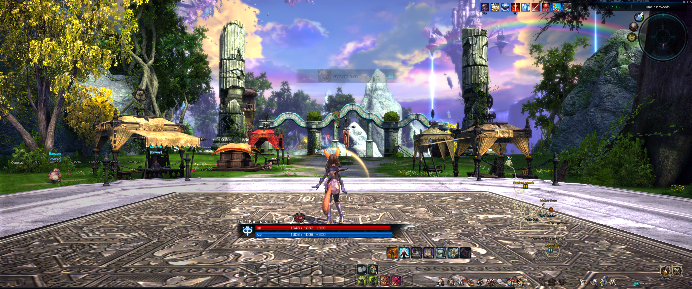

---

## Level 13 to 20

Before you do anything, open the **TERA store** and grab the free underwear. Without that giant defense boost the next part is actual suffering.

Teleport to **Crescentia** and go south. There’s a downhill road with a bunch of **Hyena Stalkers** chilling there. They’re way above your level but who cares, you just equipped underwear that makes you virtually invulnerable. Pull a group of the monsters, kill them, repeat. Go slow at first, then ramp it up once you get comfy.

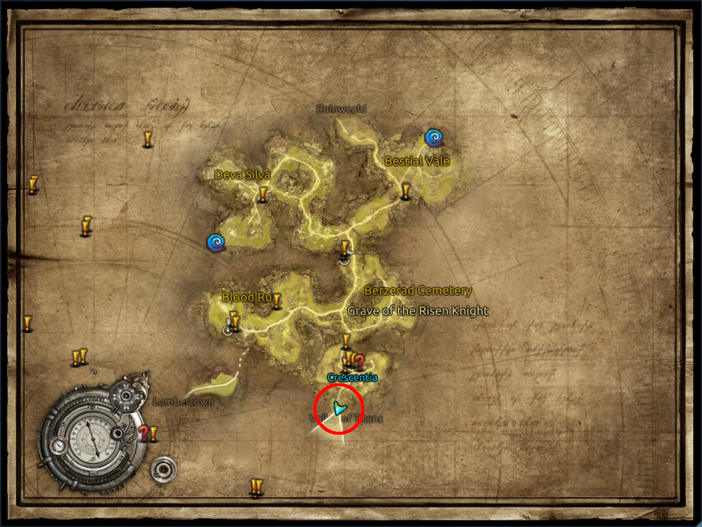

Use your pet to collect all the loot so you don’t waste time spamming `f` like a clown.

Stay here until you’re **level 20**. These mobs will eventually start dropping **avatar weapon shards**, and once you complete the set you get your first **avatar weapon**. Your number one priority is getting that thing to **+9** the moment you get it. If you don’t, the next section is gonna feel like punching concrete.

You’ll also start getting **glyphs** around this point. Invest them as soon as you unlock them, they’re massive damage boosts. Even if you have no idea in what, you can reskill at any time for free.

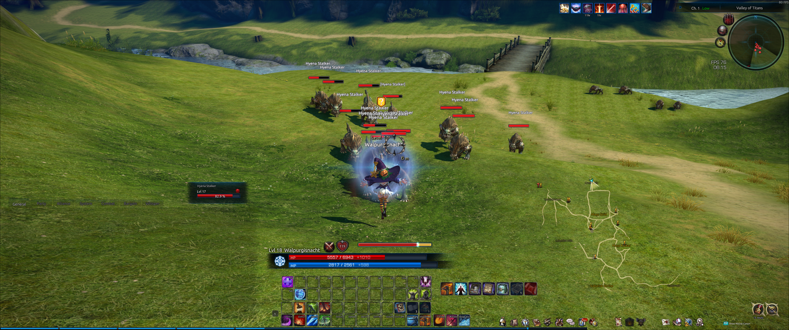

---

## Level 20 to 26

Once you reach **level 20** with your **avatar weapon at +9** return to **Crescentia** and head north into **Bestial Vale**. Here you’ll encounter your first real **BAMs**, the standard **Basilisks**.

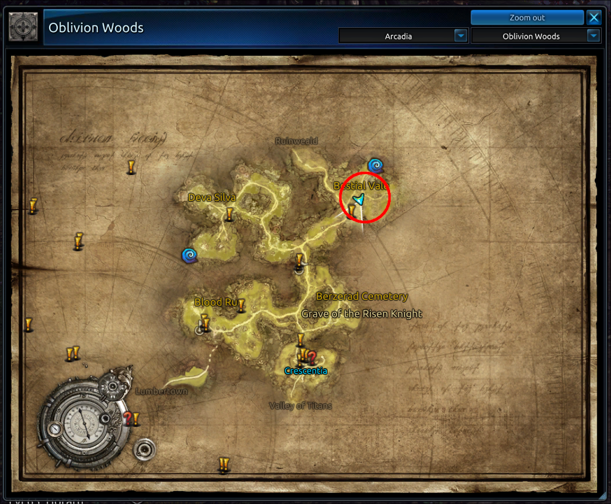

They hit hard but move super slowly, so take them down one at a time, and remember to switch to your **BAM crystal setup**. They give decent EXP, so you can hang out here for a while.

In theory, you could grind up to around **level 29**, but you can't get the **level 26 avatar weapon** here which is a problem.

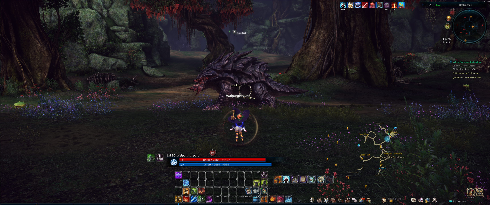

---

## Level 26 to 28

This part isn’t really about leveling, it’s more about getting your next **avatar weapon**, since the next major **BAM type** is **level 27**, so way too high for your **level 20 avatar weapon**.

Teleport to **Lumbertown** and make your way down to **Celestial Hills**. In the center of that area is the **Omphalos Plains** zone.

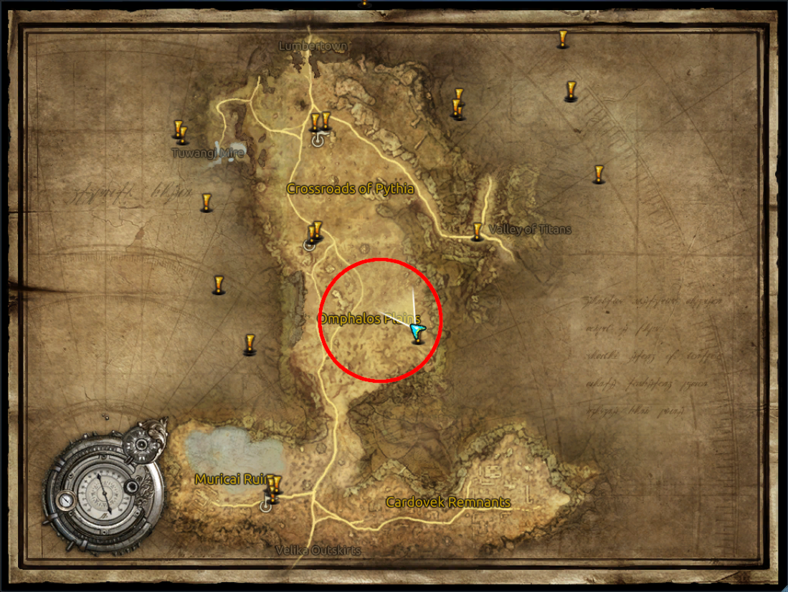

You’ll find three **BAM types** here:

* **Torpid Kuma**
* **Indolent Kuma**
* **Naga Mercenary**

They all take roughly the same time to kill, but **Torpid Kuma** gives about 30% more EXP, so focus on those.

Stick around until you get your new **avatar weapon**, then make it **+9** before moving on to the next step.

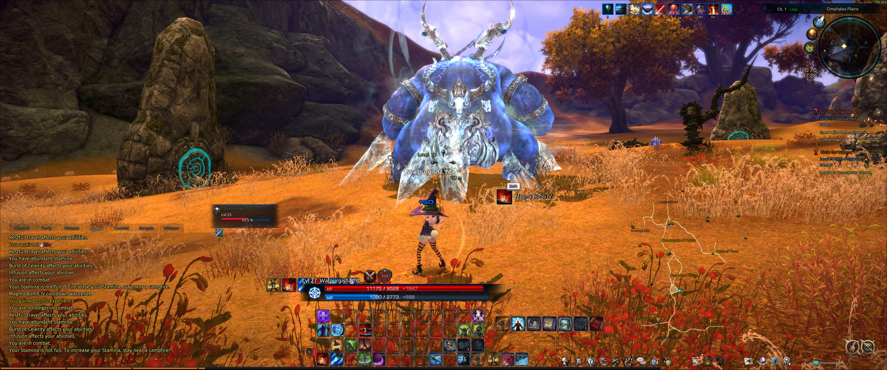

---

## Level 28 to 33

Next up is **Lurking Ovolith**, right in front of **Sinestral Manor**. You can either buy a teleport scroll from the specialty store or teleport to **Popolion** and walk there.

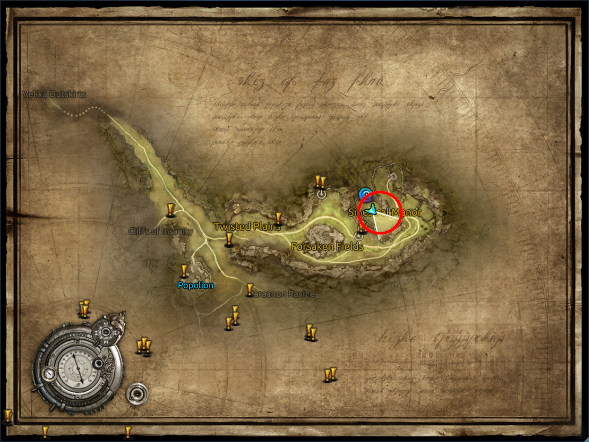

Nothing fancy here, just take them down one at a time. Stay until you get your next **avatar weapon**. Make sure to learn which side is back when they are idle, they give you some time to do damage before they attack you.

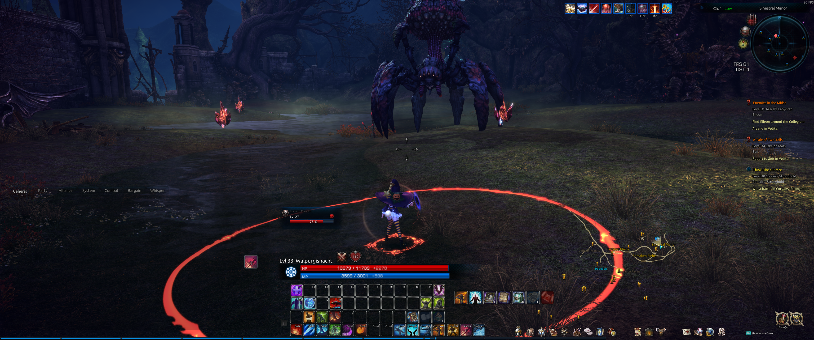

---

## Lvl 33 to 38

You can start this as soon as you get your **lvl 32 avatar weapon** from farming **Lurking Ovolith**, then upgrade it to **+9**.

Teleport to **Cutthroat Harbor**, head north into **Ascension Valley**, and make your way to **Azarel's Labyrinth**.

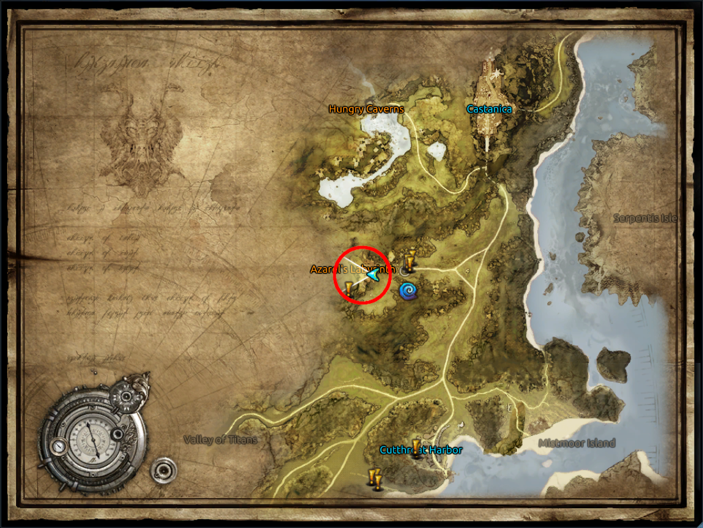

After entering **Azarel's Labyrinth**, drop down one floor, then another, until you reach ground level. You will find three rooms next to each other that contain **Labyrinthine Stalkers**.

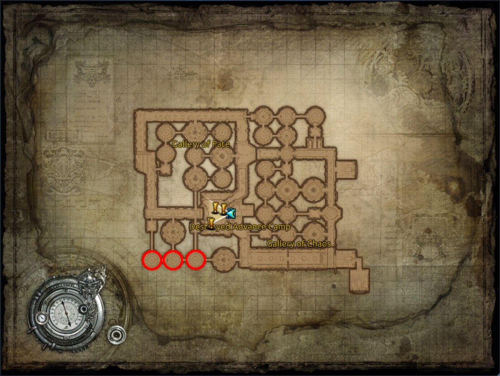

These mobs are still pretty easy to kill, but they hit hard so stay alert. You should also get your next avatar weapon here for **lvl 38**. Technically it is best to leave at 38, but stay until you get that weapon since you will need it for the next sections.

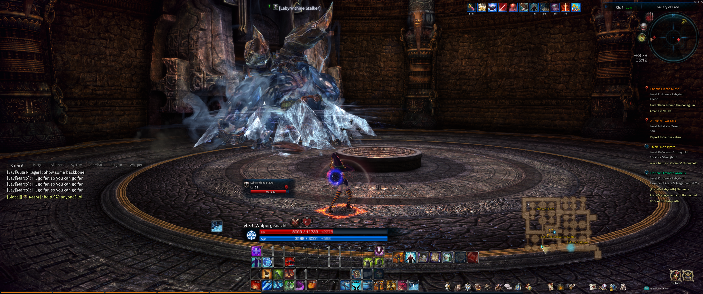
